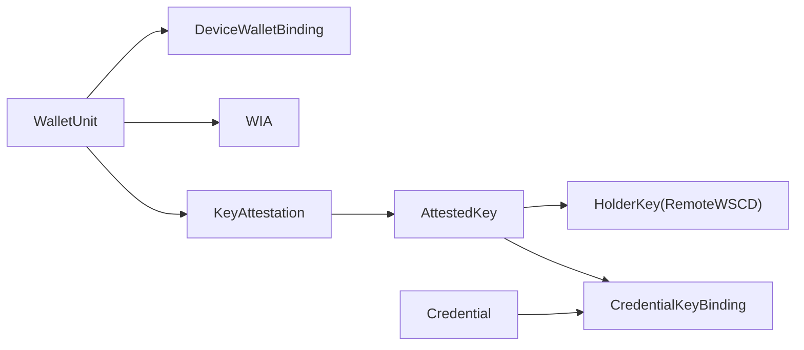

# DI-Swallet: Wallet Provider Backend (WPB)

This repository contains the implementation of the **Wallet Provider Backend (WPB)** for the EU Digital Identity Wallet architecture, as defined in the **DI-Swallet** research project at **Instituto Superior Técnico**.

## 🏗️ Architecture Components
- **WPI (Wallet Provider Interface):** REST API for communication with the User Domain.
- **WSCA (Wallet Secure Cryptographic Application):** Secure service layer managing hardware-backed operations.
- **Remote WSCD (Wallet Secure Cryptographic Device):** Virtualized HSM environment using **SoftHSM2**.
- **Security Interceptor:** Gateway that enforces the **Sole Control** mandate via authorization headers.
- **Key Metadata Store:** Database layer to track key lifecycles (Candidate, Active, Revoked).

## 🛠️ Tech Stack
- **Language:** Kotlin 2.2.0
- **Framework:** Spring Boot 3.5.14
- **Cryptography:** BouncyCastle (Standard Security Provider)
- **Persistence:** Spring Data JPA with PostgreSQL (runtime) + H2 (tests)
- **Standard:** PKCS#11 (SunPKCS11)

## 🚀 Prerequisites
- Ubuntu 24.04 (Noble)
- SoftHSM2: `sudo apt install softhsm2 opensc`
- OpenJDK 17: `sudo apt install openjdk-17-jdk`

## ⚙️ Environment Setup

### 1. Initialize the SoftHSM2 token
Run these commands once to create your virtual hardware vault:
```bash
mkdir -p ~/softhsm/tokens
echo "directories.tokendir = $HOME/softhsm/tokens" > ~/.softhsm2.conf
echo "objectstore.backend = file" >> ~/.softhsm2.conf
softhsm2-util --init-token --free --label "DI-Swallet-WSCD" --pin 1234 --so-pin 123456
```

### 2. Configure the HSM Library Path
The backend needs to know where the SoftHSM2 library is located in your system. 
Open `app/src/main/resources/application.properties` and verify the path:
```properties
# Default path for Ubuntu 24.04
wpb.hsm.library=/usr/lib/x86_64-linux-gnu/softhsm/libsofthsm2.so
```

## 💻 Running the Application

### 1. Start the Persistence Layer (Docker)
The application requires a PostgreSQL database to store key metadata and credentials.
Run the following command in the project root:
```bash
docker compose up -d
```

### 2. Start the Backend (WPB)
The `SOFTHSM2_CONF` variable and library paths are automatically handled by the Gradle build script.
```bash
./gradlew :app:bootRun
```

### 3. Access the API Documentation
Once the server is running, you can interact with the Wallet through the interactive Swagger UI:
👉 **[http://localhost:8080/swagger-ui.html](http://localhost:8080/swagger-ui.html)**

## 🧪 Testing & Validation
Run the automated integration tests to verify the full cryptographic lifecycle:
```bash
./gradlew clean test
```
*The test suite produces clean audit logs showing the interaction between the Security Gateway and the HSM.*

### Test coverage (JaCoCo)
After tests run, Gradle generates a coverage report automatically (`test` is finalized by `jacocoTestReport`):

```bash
./gradlew :app:clean :app:test :app:jacocoTestReport
```

Open the HTML report:
`app/build/reports/jacoco/test/html/index.html`

XML report (for CI tools such as SonarQube):
`app/build/reports/jacoco/test/jacocoTestReport.xml`

Optional minimum line-coverage gate (30% on application code, excluding `WpbApplication`):

```bash
./gradlew :app:jacocoTestCoverageVerification
```

Integration tests that require SoftHSM2 must pass locally for coverage to reflect the full suite; unit tests (OpenID4VP lifecycle, DCQL, matcher, VP builder, etc.) run without the emulator.

## 📂 API Reference

### Mandatory Security
Protected endpoints require `X-Wallet-Authorization`:
- **WebAuthn assertion (expected format):** `fido2-assertion:<Base64URL_JSON>`

Real flow (for development and production-aligned testing):
1. Register a device with `POST /api/v1/wallet/auth/register/{userId}`.
2. Request a challenge with `GET /api/v1/wallet/auth/challenge/{userId}`.
3. Sign the challenge in the client authenticator and send the assertion in `X-Wallet-Authorization`.

### 1. Generate User Key
**Function:** Generates a hardware-protected EC KeyPair inside the HSM and stores metadata in the DB.
- **Endpoint:** `POST /api/v1/wallet/keys/{userId}`
- **Example:**
  ```bash
  curl -i -X POST http://localhost:8080/api/v1/wallet/keys/pedro-ist \
    -H "X-Wallet-Authorization: fido2-assertion:<Base64URL_JSON>"
  ```

### 2. Retrieve Key Metadata
**Function:** Returns the public key and status of a user's wallet.
- **Endpoint:** `GET /api/v1/wallet/keys/{userId}`

### 3. Digital Signature
**Function:** Performs an ECDSA signature inside the HSM boundary. The private key never leaves the hardware.
- **Endpoint:** `POST /api/v1/wallet/sign/{userId}`
- **Example:**
  ```bash
  curl -i -X POST http://localhost:8080/api/v1/wallet/sign/pedro-ist \
    -H "X-Wallet-Authorization: fido2-assertion:<Base64URL_JSON>" \
    -H "Content-Type: application/json" \
    -d '{"data": "Digital Signature Test for IST Thesis"}'
  ```

## 🛡️ Security Note
This implementation ensures that **private keys are non-exportable** and HSM-backed signing is enforced.  
For full production-grade **LoA High/QES** posture, additional hardening remains (for example: trusted attestation configuration and verified onboarding checks).

### LoA High gaps (document for thesis / production planning)

The WPB prototype intentionally stops short of full **LoA High** device assurance. The following gaps should be stated explicitly in the thesis and closed before any production deployment:

| Gap | Default / current behaviour | Production expectation |
|-----|----------------------------|------------------------|
| **FIDO2 MDS** | Not implemented (`Fido2Service`); hardware attestation roots are not verified via the FIDO Metadata Service | Verify authenticator metadata and AAGUID against MDS for hardware-backed keys |
| **Untrusted attestation** | `wallet.allow-untrusted-attestation=true` in dev; `application-prod.properties` sets it to `false` | Keep `false` in prod; require genuine hardware attestation during onboarding |
| **WSCD** | SoftHSM2 (software token) | Certified remote HSM / QSCD (FIPS 140-2 L3 or CC EAL4+) |
| **Onboarding without SUA** | `/wallet/init` and `/auth/register/{userId}` are open for bootstrap | Strong user authentication before key generation in production |

`application-prod.properties` already disables untrusted attestation and enforces secret validation via `ProductionReadinessValidator`; MDS integration and certified WSCD remain out of scope for this academic prototype.

**Dev-only mock components:** `MockIssuerController` (`POST /credentials/issue*`) and `MockRpController` are not registered when `prod` is active. Mock PID issuance is scoped to `@Profile("dev")`; production issuance must use OID4VCI only.

### HSM PIN (all profiles)

`HsmPinStartupValidator` runs on **every** profile and rejects the known SoftHSM demo PIN (`1234`) unless `wpb.hsm.allow-known-weak-pin=true` is set explicitly. That opt-in is enabled only in `application-dev.properties` and `application-test.properties` (CI/local). Staging and production must set `HSM_PIN` to a non-default secret; `ProductionReadinessValidator` enforces the same rule again when `prod` is active. The PIN is still held in memory as a `String` for PKCS#11 — externalize via environment variables and restrict host access to the HSM socket.

**Bundled signing keys (prod):** `ProductionReadinessValidator` rejects the dev classpath keys bundled in the JAR (`classpath:status-list/dev-signing-key.pem`, `classpath:mdoc/dev-issuer-key.pem`) and any `classpath:` PEM path. Provision external `file:` paths via `WPB_STATUS_LIST_SIGNING_KEY_PEM_PATH` and `WPB_MDOC_ISSUER_KEY_PEM_PATH`.

### Crypto secrets (all profiles)

`CryptoSecretsStartupValidator` applies the same pattern to `wallet.disclosures.encryption-key`, `wpb.transaction-log.integrity-key`, and `wpb.transaction-log.encryption-key` (when `dek-mode=server`). Known weak defaults are rejected unless `wpb.security.allow-known-weak-crypto-secrets=true` (dev/test only). Base `application.properties` requires `WALLET_DISCLOSURES_ENCRYPTION_KEY` and `WPB_TRANSACTION_LOG_*` env vars; documented demo keys live in `application-dev.properties` only. `TransactionLogCrypto` rejects **blank** keys explicitly (no silent dev fallback).

### FIDO2 challenges (cluster-safe)

`ChallengeService` persists WebAuthn `AssertionRequest` rows in PostgreSQL (`fido2_assertion_challenges`, Flyway `V7`). Challenges are keyed by **challenge value**, so parallel ceremonies for the same holder no longer overwrite each other. Verification matches `clientDataJSON.challenge` to the stored row; expired rows are purged on a schedule. This supports horizontal scaling when all instances share the same database.

### WI→WSCA boundary (SCI / WWI prototype)

The architecture PDF requires a **Secure Cryptographic Interface** between Wallet Instance logic and the WSCA before any HSM command runs. This prototype enforces that boundary when `wpb.wsca.enforce-sci-boundary=true` (default; enabled in `prod`):

| Mechanism | Purpose |
|-----------|---------|
| **FIDO2 success** | Issues a short-lived SCI grant and binds the authenticated holder on the HTTP request |
| **Holder consent** | Extends the SCI grant for multi-step OID4VP/OID4VCI flows (signing, VP build, credential storage) |
| **`WscaAccessGuard` on `HsmService`** | Blocks signing and key generation unless a grant or bootstrap context is active |
| **`WscaSciBootstrap`** | Allows pre-authentication device registration only |

**Prototype limitation:** OID4 session start also issues a holder-scoped grant so issuer/presentation flows can complete without FIDO2 on every HTTP hop. A production deployment should replace this with per-operation FIDO2 or a hardware-bound session token. Internal JVM callers cannot bypass the guard when enforcement is on and no grant is present — but a full RCE could still mutate grants in memory; document as research prototype, not CC-certified separation.

### Normative specification gaps (thesis scope)

The WPB prototype targets OID4VP/OID4VCI wallet-side flows and related wallet services. The following ARF technical specifications are **explicitly out of scope** for this repository and should be stated as such in the thesis:

| Spec | WPB status | Thesis note |
|------|------------|-------------|
| **Wallet-to-Wallet** | **Not implemented** | No ISO 18013-5 device retrieval, W2W service endpoints, or proximity presentation coverage. Holder-to-holder presentation is a future WPI + WPB extension, not part of this MVP. |
| **Attribute catalogues and schemes** | **Not implemented** | Commission-operated catalogue APIs for QTSPs and scheme discovery are not hosted or queried by the WPB. The WPB consumes credential configurations (DCQL claim paths, consent views) from issuers and RPs. Document as out-of-wallet-provider scope unless catalogue clients are added in a later milestone. |

Other deferred items (ZKP, EU WebAuthn profile, migration import, RP dashboard UI) remain listed under each feature section’s **Out of scope** notes below.

## OpenID4VP Demo Mode Warning
Some OpenID4VP shortcuts used for local emulator validation are protected behind:

- `wpb.openid4vp.demo-mode=false` (default)

When `wpb.openid4vp.demo-mode=true`, the backend enables demo-only behavior such as:

- resolving emulator authorization requests (ES256 JWT + `verifier_info.x5c`) with PKIX trust against bundled `demo-lote.json`
- synthetic credential candidates when the wallet has no matching credentials
- fallback request resolution/dispatch paths for emulator scenarios

Important:

- Never enable `wpb.openid4vp.demo-mode` in production or public environments.
- Keep it enabled only for controlled local testing.

Example (local demo run only):

```bash
./gradlew :app:bootRun --args='--wpb.openid4vp.demo-mode=true'
```

## OpenID4VP (Presentation)

This section documents what the OpenID4VP presentation stack delivers in this
code base, and — equally important — what is intentionally **not**
production-ready. The scope is validating the protocol baseline and the internal
architecture; later milestones will replace the placeholders listed below.

### Capabilities

| Capability | Status |
|---|---|
| Orchestrator-centric OpenID4VP lifecycle (`/openid4vp/authorize`, `/consent`, `/session/{id}`, `/session/{id}/events`) | Implemented |
| Formal state machine with runtime-enforced transitions (`RECEIVED → REQUEST_RESOLVED → VERIFIER_VALIDATED → POLICY_EVALUATED → CONSENT_PENDING → CONSENT_GRANTED → VP_BUILT → DISPATCHED`, plus `FAILED / REJECTED / EXPIRED`) | Implemented |
| EUDI OpenID4VP SDK integration behind `OpenId4VpGateway` (strict resolve + dispatch through `eudi-lib-jvm-openid4vp-kt`) | Implemented |
| Demo-only fallback resolver for the local Flask verifier emulator (off by default) | Implemented behind `wpb.openid4vp.demo-mode` |
| Per-query DCQL parsing (`credentials[]` standard form and emulator `query[]` form) | Implemented |
| Credential matching with format filter and per-query requested claim names | Implemented (SD-JWT only) |
| Real SD-JWT presentation generation with disclosure filtering and **Key Binding JWT signed inside the HSM** (`sd_hash`, `aud`, `nonce`) | Implemented |
| Trust validator with client-id prefix validation and configurable allow-list (`wpb.openid4vp.trust.allowed-client-ids`) | Implemented (baseline allow-list; full LoTE via trust framework integration) |
| Optimistic-locking in-memory session repository with structured `SessionEvent` event store | Implemented |
| Consistent negative/error dispatch to the verifier on every terminal rejection (trust, policy, no-match, consent denial, invalid request with `dispatchDetails`) | Implemented |
| Per-session correlation ID propagated through logs and the event store | Implemented |
| Test coverage (state machine, repository, orchestrator happy + negative paths, DCQL parser, matcher, trust validator, SD-JWT VP builder, SDK adapter fallback path) | Implemented |

### Explicit non-production limitations

The items below are **deliberate** within the scope of this thesis prototype.
They are either stubbed, partially implemented, or guarded by `demo-mode`.

| Limitation | Why acceptable now | Planned hardening |
|---|---|---|
| **ISO mdoc presentations are not built**: `CredentialFormat.MDOC` candidates throw `UnsupportedOperationException` from `DefaultVpTokenBuilder`. mdoc is declared in the SDK configuration but no encoder is wired. | ISO 18013-5 mdoc support is deferred to the dedicated mdoc section below. | ISO mdoc presentation encoding |
| **Trust validation is a thin baseline**: client-id prefix scheme allow-list plus a static comma-separated trust list. No certificate-chain validation, no List of Trusted Entities (LoTE) lookup, no access-certificate evaluation. | Baseline only needs to reject obviously malformed verifiers and document the boundary. | Trust framework integration (LoTE) |
| **Response encryption is not negotiated per-request**: `EncryptionParameters` is generated as a fresh random Diffie-Hellman value per dispatch rather than derived from verifier metadata / JWKS. | The wallet still wires the SDK's `ResponseEncryptionConfiguration` (ECDH-ES / A256GCM) and the SDK handles the cryptographic envelope; only the wallet-side contribution is simplified. | Future hardening pass |
| **Demo-mode fallback resolver** parses authorization requests as plain JSON or signed JWTs (local emulator uses ES256). It is off by default and rejects when not enabled. | Required to exercise the protocol end-to-end without operating a full HAIP verifier deployment. | Removed when a production signed verifier is integrated |
| **Verifier emulator** signs requests with a dev EC key and embeds an access certificate in `verifier_info.x5c` for PKIX trust against `demo-lote.json`. | Exercises real trust validation in thesis demos; keys are not production material. | Replaced by a national verifier in interop tests |
| **Sessions are stored in memory** (`InMemoryPresentationSessionRepository`) and the SDK adapter keeps `ResolvedRequestObject` in a per-instance `ConcurrentHashMap`. | A single instance is enough for protocol validation. | Durable transaction log |
| **Policy engine blocks server-side** (trust + registry intended-use); holder-facing minimisation warnings are in consent views. | Registry enforcement is server-side; consent views surface warnings in the WPI. | Implemented |
| **Consent submit requires FIDO2** on `POST /openid4vp/consent` and `POST /openid4vci/consent` (RPA_08). | Gate at approval moment, not at authorize. | Implemented |
| **Session reads require FIDO2** on `GET /openid4vp/session/**` and `GET /openid4vci/session/**` (consent-view, session, events). Bootstrap POST paths (`/authorize`, `/offer/resolve`, …) stay open for WPI. | Holder-bound session data must not leak without SUA. | Implemented (audit A10) |
| **WIA / KA / device binding** is not exercised inside the OpenID4VP flow. The credential's KB-JWT is signed by the holder's HSM key but no WIA is attached. | WIA and KA are handled in dedicated issuance flows. | WIA and KA integration (see below) |
| **Array-of-object paths** (wildcard/index into arrays of objects) depend on issuer structuring; only scalar arrays and key paths are matched. | PID rulebook often uses flat dot-notation or whole-array claims. | Real issuer credentials + interop testing |
| **Deeply nested SD-JWT** (objects within objects, each with `_sd`) is only supported for one nesting level in mock issuance. | Covers typical PID `address` object + common DCQL paths. | Full recursive issuance with external issuers |

### Configuration knobs

```
wpb.openid4vp.demo-mode=false               # enable local emulator fallback (off by default)
wpb.openid4vp.trust.allowed-client-ids=     # CSV allow-list of verifier client_id values (empty = open)
wpb.openid4vp.session.ttl-seconds=600       # presentation session expiry
```

### End-to-end smoke flow with the emulator

```bash
# 1. start the verifier emulator (Flask, port 8081)
cd verifier-emulator && python3 -m venv .venv && .venv/bin/pip install -r requirements.txt && .venv/bin/python app.py

# 2. start the wallet with demo-mode enabled
./gradlew :app:bootRun --args='--wpb.openid4vp.demo-mode=true'

# 3. start a presentation session against the emulator's request_uri
curl -X POST http://localhost:8080/openid4vp/authorize \
  -H 'Content-Type: application/json' \
  -d '{"requestUri":"http://localhost:8081/request/direct_post.json","holderId":"pedro-ist"}'

# 4. fetch consent view for WPI (holderId must match session)
curl "http://localhost:8080/openid4vp/session/<uuid>/consent-view?holderId=pedro-ist"

# 5. submit consent (FIDO2 required in production; sessionId from step 3)
curl -X POST http://localhost:8080/openid4vp/consent \
  -H 'Content-Type: application/json' \
  -H 'X-Wallet-Authorization: fido2-assertion:<base64url-json>' \
  -d '{"sessionId":"<uuid>","holderId":"pedro-ist","granted":true,"selectedCredentialIds":["<candidateId>"]}'

# 6. inspect the lifecycle trail
curl http://localhost:8080/openid4vp/session/<uuid>/events | jq .
```

## OpenID4VCI (Issuance Core)

The OID4VCI stack extends the wallet with an orchestrator that follows the
exact same architectural rules as OpenID4VP (adapter-based, orchestration-centered,
SDK-decoupled, lifecycle/state-machine driven, session persistence, audit/event
model). The wallet acts strictly as a **wallet-side** OID4VCI client and never
implements issuer endpoints.

### Capabilities

| Capability | Status |
|---|---|
| Orchestrator-centric OID4VCI lifecycle (`/openid4vci/offer/resolve`, `/authorize/prepare`, `/authorize/code`, `/authorize/pre-authorized`, `/credential/request`, `/deferred/query`, `/notify`, `/session/{id}`, `/session/{id}/events`) | Implemented |
| Formal state machine with runtime-enforced transitions (`OFFER_RECEIVED → OFFER_RESOLVED → AUTHORIZATION_PREPARED → AUTHORIZED → CREDENTIAL_REQUESTED → CREDENTIAL_ISSUED → NOTIFIED`, deferred branch via `DEFERRED_PENDING → DEFERRED_ISSUED`, plus `FAILED / REJECTED / EXPIRED`) | Implemented |
| Adapter port `OpenId4VciGateway` isolates the EUDI library (only `openid4vci.adapter` may import `eu.europa.ec.eudi.openid4vci.*`) | Implemented |
| Credential offer resolution (by-value and by-reference) producing `ResolvedOffer` + `ResolvedIssuerMetadata` | Implemented (simulated default; SDK adapter when `demo-mode=false`) |
| Authorization-code grant with PKCE + automatic PAR usage when supported + DPoP probe | Implemented (simulated default; SDK adapter when `demo-mode=false`) |
| Pre-authorized-code grant with optional `tx_code` | Implemented (simulated default; SDK adapter when `demo-mode=false`) |
| Credential request via `credential_configuration_id` or `credential_identifier` (HAIP SD-JWT VC) | Implemented (simulated default; SDK adapter when `demo-mode=false`) |
| Deferred issuance: `transaction_id` persistence, polling, resumed issuance with stable PoP key | Implemented (simulated default; SDK adapter when `demo-mode=false`) |
| Wallet → Issuer notifications: `CREDENTIAL_ACCEPTED`, `CREDENTIAL_DELETED`, `CREDENTIAL_FAILURE` | Implemented (simulated default; SDK adapter when `demo-mode=false`) |
| SDK-backed adapter (`SdkOpenId4VciGateway`) exercised end-to-end via WireMock + Spring orchestrator test | Implemented |
| HSM-backed proof material (`HsmBackedProofMaterialProvider` + `HsmProofJwtSigner`) as default Spring wiring | Implemented |
| Issuer `signed_metadata` JWT validation (`preferSigned` / `requireSigned` / `ignoreSigned`) | Implemented |
| Issued credential persistence into the existing `WalletCredentialRepository` (SD-JWT split into encoded JWT + AES-GCM-encrypted disclosures) | Implemented |
| Issuer trust validator with configurable allow-list (`wpb.openid4vci.trust.allowed-issuer-ids`) | Implemented |
| Issuance policy with mdoc opt-out (`wpb.openid4vci.policy.allow-mdoc=false`) | Implemented |
| Optimistic-locking in-memory session repository (`InMemoryIssuanceSessionRepository`) | Implemented |
| Structured event store (`IssuanceEvent` + `InMemoryIssuanceEventStore`) with correlation IDs | Implemented |
| JaCoCo coverage gate for issuance module: ≥ 50% (current actual: ~90%) | Implemented |
| Issuance test suite (state machine, repository, policy, trust, simulated adapter happy + deferred + negative, orchestrator real-beans flow, controller, storage, proof, event store) | Implemented |

### Explicit non-production limitations

| Limitation | Why acceptable now | Planned hardening |
|---|---|---|
| **Default runtime and CI test profile keep `demo-mode=true`**, so the simulated adapter remains the primary local smoke path. Real issuer interop (`SdkOpenId4VciGatewayRealIssuerIT`) is opt-in via env vars. | Deterministic simulator for day-to-day development; SDK path validated against WireMock in `SdkOpenId4VciOrchestratorE2ETest`. | Scheduled/manual smoke against a live PID Provider when WIA crypto is production-ready. |
| **Issuer trust is still an allow-list** plus `signed_metadata` JWT verification — no federation/LoTE trust-list lookup and no full metadata PKIX policy. | Rejects unknown issuers and enforces `wpb.openid4vci.sdk.metadata-policy`. | Trust framework integration. |
| **`EphemeralProofMaterialProvider` is disabled by default** (`wpb.openid4vci.proof.ephemeral-fallback=false`). Unit tests may still construct it manually. | Production wiring uses `HsmBackedProofMaterialProvider` (`@Primary`) and `HsmProofJwtSigner`. | — |
| **mdoc issuance is deferred**: the simulator returns `unsupported_format` for `MSO_MDOC` and the policy rejects mdoc credential configurations unless `wpb.openid4vci.policy.allow-mdoc=true`. | mdoc support is covered in the dedicated mdoc section below. | ISO 18013-5 mdoc issuance. |
| **Sessions are stored in memory** (`InMemoryIssuanceSessionRepository`) and adapter SDK state is per-instance. Optimistic locking is in place but no JPA persistence. | Single-instance prototype is enough for protocol validation. | Durable transaction log. |
| **Deferred polling uses a counter** in the simulator (`wpb.openid4vci.simulator.deferred-polls-before-issue`) rather than real issuer-driven retry hints. | The simulator must produce deterministic deferred behaviour for tests. | Replaced by real issuer interaction after WIA integration. |
| **Issuance storage consent** pauses at `ISSUANCE_CONSENT_PENDING` until `POST /openid4vci/consent` (FIDO2). Preview via `GET /session/{id}/consent-view`. | Holder must approve before `WalletCredential` persistence. | Implemented (see Privacy Controls and Consent). |
| **The simulated SD-JWT VC payload is syntactically shaped but cryptographically meaningless** (no real issuer signature, no real `cnf` binding). | Validates the orchestration contract, not credential cryptography (presentation already exercises real signature production). | Real issuer signatures arrive with the SDK adapter wiring. |
| **By-reference offer resolution does not actually fetch the URL** in the simulator. | A real HTTP fetch belongs to the SDK-backed adapter. | SDK adapter hardening. |

### Configuration knobs

```
wpb.openid4vci.demo-mode=true                                # simulated adapter (default)
wpb.openid4vci.session-ttl-seconds=1800                      # issuance session expiry
wpb.openid4vci.trust.allowed-issuer-ids=                     # CSV allow-list (empty + demo-mode permissive)
wpb.openid4vci.trust.clock-skew-seconds=60                  # signed_metadata JWT exp/nbf/iat tolerance
wpb.openid4vci.proof.ephemeral-fallback=false                 # true only for isolated unit tests
wpb.openid4vci.policy.allow-mdoc=false                       # opt-in mdoc
wpb.openid4vci.simulator.always-defer=false                  # force deferred outcome
wpb.openid4vci.simulator.deferred-polls-before-issue=1       # polls before simulated issuance
wpb.openid4vci.sdk.credential-issuer-id=                     # hint for real SDK adapter
wpb.openid4vci.sdk.dpop-mode=supported                       # supported | required | disabled
wpb.openid4vci.sdk.metadata-policy=preferSigned              # preferSigned | requireSigned | ignoreSigned
wpb.openid4vci.sdk.pkce-required=true                        # PKCE always enforced
wpb.openid4vci.sdk.use-par-when-supported=true               # send PAR when issuer advertises it
```

### End-to-end smoke flow with the simulator

```bash
# 1. start the wallet (demo-mode is the default)
./gradlew :app:bootRun

# 2. resolve a credential offer (by-value)
OFFER='openid-credential-offer://credential_offer={"credential_issuer":"https://issuer.example","credential_configuration_ids":["pid_jwt"]}'
curl -X POST http://localhost:8080/openid4vci/offer/resolve \
  -H 'Content-Type: application/json' \
  -d "{\"offerUri\":\"$OFFER\",\"holderId\":\"pedro-ist\"}"

# 3. prepare the authorization-code grant
curl -X POST http://localhost:8080/openid4vci/authorize/prepare \
  -H 'Content-Type: application/json' \
  -d '{"sessionId":"<uuid>"}'

# 4. complete the authorization-code grant
curl -X POST http://localhost:8080/openid4vci/authorize/code \
  -H 'Content-Type: application/json' \
  -d '{"sessionId":"<uuid>","authorizationCode":"code-abc","state":"<state-from-prepare>"}'

# 5. request the credential
curl -X POST http://localhost:8080/openid4vci/credential/request \
  -H 'Content-Type: application/json' \
  -d '{"sessionId":"<uuid>","credentialConfigurationId":"pid_jwt"}'

# 6. notify the issuer
curl -X POST http://localhost:8080/openid4vci/notify \
  -H 'Content-Type: application/json' \
  -d '{"sessionId":"<uuid>","event":"CREDENTIAL_ACCEPTED"}'

# 7. inspect the lifecycle trail
curl http://localhost:8080/openid4vci/session/<uuid>/events | jq .
```

## OpenID4VCI / WIA (Wallet Instance Attestation)

WIA is integrated as a **sub-context inside the existing issuance flow**, not as a
separate top-level lifecycle. The issuance orchestrator selects or issues a WIA,
attaches it to PAR/token transport, validates technical freshness, and verifies
that the access token `cnf.jkt` matches the WIA `cnf` key before credential
issuance proceeds.

There is **no** public `POST /wia/issue` endpoint in this increment.

### Capabilities

| Capability | Status |
|---|---|
| WIA sub-context on `IssuanceContext` (`WiaState`, `WiaContext`, `WalletInstanceAttestation`) | Implemented |
| `WalletAttestationProvider` abstraction with `DefaultWalletAttestationProvider` (generation) | Implemented |
| WIA transport envelope on `OpenId4VciGateway` (`WalletAttestationTransport` on PAR/token paths) | Implemented (simulated adapter) |
| WIA validation service (technical expiry + `cnf.jkt` binding against access token) | Implemented |
| Simplified WIA status management via existing bitstring status list (`WiaStatusManagementService`) | Implemented |
| Persistent `cnf` key per wallet instance (RFC 7638 JWK thumbprint of `WalletKey` EC public key) | Implemented |
| HSM-backed WIA/PoP JWT signing via `JwsSigningService` with parsed `x5c` certificate chain | Implemented |
| Durable WIA status index mapping (`JpaWiaStatusManagementService` + `wia_status_indexes`) | Implemented |
| Structured issuance events: `wia.attached`, `wia.binding.verified` | Implemented |
| Retry semantics for nonce mismatch / expired WIA (configurable limits, recoverable errors) | Implemented |
| Default reuse policy per issuer: `false` (`wpb.openid4vci.wia.reuse-per-issuer`) | Implemented |
| WIA-specific unit tests (validation, status management, orchestrator + adapter integration) | Implemented |

### Explicit non-production limitations

| Limitation | Why it is acceptable for the thesis MVP | Where it will be addressed |
|---|---|---|
| **No issuer-side WIA trust-anchor validation** (wallet signs with HSM + publishes `x5c`, but LoTE/PKIX federation is not enforced). | Issuer trust of Wallet Provider certificates belongs to external PID Providers and the trust framework. | LoTE trust anchors and access-certificate validation. |
| **No issuer-side WIA signature/trust validation** (wallet only generates and self-checks binding). | Issuer validation belongs to external PID/Attestation Providers, not the WPB. | Interop tests with real issuers. |
| **DPoP proof headers are modeled via `cnf.jkt` binding**, not full RFC 9449 DPoP JWT construction against live AS metadata. | Goal is WIA transport + AT binding correctness, not full OAuth stack hardening. | SDK adapter + production OAuth profile. |
### Configuration knobs

```
wpb.openid4vci.wia.enabled=true
wpb.openid4vci.wia.token-ttl-seconds=21600                 # WIA JWT exp (< 24h)
wpb.openid4vci.wia.min-status-maintenance-days=31          # client_status.exp horizon
wpb.openid4vci.wia.reuse-per-issuer=false                 # privacy-first default
wpb.openid4vci.wia.wallet-name=DI-Swallet-WPB
wpb.openid4vci.wia.wallet-version=0.1.0
wpb.openid4vci.wia.wallet-link=
wpb.openid4vci.wia.wallet-solution-certification-information=thesis-mvp-not-certified
wpb.openid4vci.wia.signing-x5c=
wpb.openid4vci.wia.max-nonce-mismatch-retries=1
wpb.openid4vci.wia.max-expired-retries=1
```

### WIA-related events in issuance sessions

After `authorize/prepare` or `authorize/code`, inspect:

```bash
curl http://localhost:8080/openid4vci/session/<uuid>/events | jq '.[] | select(.type | startswith("wia."))'
```

Expected event types in the happy path:

- `wia.attached`
- `wia.binding.verified`

## OpenID4VCI / KA (Key Attestation)

KA is now enforced for device-bound issuance configurations inside the existing
issuance lifecycle. There is no dedicated public KA endpoint: the wallet
generates and validates KA just before `requestCredential`, then attaches it as
`key_attestation` proof material in the credential request transport.

### Explicit limitations (still non-production)

| Limitation | Why acceptable now | Planned hardening |
|---|---|---|
| LoTE-grade Wallet Provider trust anchors are not wired into KA validation yet. | Enforces leaf signature verification, optional fingerprint allow-list, and PKIX in `strict` mode; demo-mode may use the HSM self-signed chain. | Trust framework integration. |
| Strict SDK resolution requires SDK-compatible issuer endpoints (typically HTTPS); local `http://` offer/metadata testing requires explicitly disabling strict mode. | Keeps production path strict while preserving local mock-based integration tests. | Keep strict mode enabled by default and use test-only overrides when needed. |
| Real-issuer interoperability validation is provided as an opt-in smoke test and depends on external issuer availability/configuration. | Avoids coupling CI stability to external systems while still enabling real environment validation. | Expand into repeatable interop suite when a stable issuer sandbox is available. |

| KA `attested_keys.jwk` uses RFC 7638 member set (`crv`, `kty`, `x`, `y`) and `attestedJkt` matches proof key thumbprint | Implemented |
| Durable KA status index mapping (`JpaKaStatusManagementService` + `ka_status_indexes`) | Implemented |
| `KaSigningCertificateResolver` requires configured `ka.signing-x5c` outside demo-mode | Implemented |
| `require-x5c`, `allowed-x5c-fingerprints`, and effective `strict` trust outside demo-mode are enforced in validation | Implemented |

### Configuration knobs (KA trust)

```
wpb.openid4vci.ka.signing-x5c=                              # PEM/DER Wallet Provider chain (required when require-configured-signing-chain=true)
wpb.openid4vci.ka.require-configured-signing-chain=false    # set true in production deployments
wpb.openid4vci.ka.enforce-production-trust-policy=false    # set true in production deployments
wpb.openid4vci.ka.require-x5c=false
wpb.openid4vci.ka.allowed-x5c-fingerprints=                 # SHA-256 hex fingerprints (uppercase)
wpb.openid4vci.ka.trust-mode=relaxed                        # relaxed | strict
wpb.openid4vci.ka.trust-anchor-pem-paths=                 # required for strict PKIX validation
```

### Important notes

- Keep `wpb.openid4vci.sdk.strict-resolution=true` in production-like environments; this disables local fallback parsing and forces SDK resolver success.
- For local WireMock/`http://localhost` integration tests, set strict mode to `false` explicitly (test profile only).
- Real issuer smoke validation is available through `SdkOpenId4VciGatewayRealIssuerIT` and runs only when:
  - `WPB_REAL_ISSUER_ENABLED=true`
  - `WPB_REAL_ISSUER_OFFER_URI=<real offer URI>`
- Example:

```bash
WPB_REAL_ISSUER_ENABLED=true \
WPB_REAL_ISSUER_OFFER_URI='openid-credential-offer://...' \
./gradlew :app:test --tests "di.swallet.wpb.openid4vci.adapter.SdkOpenId4VciGatewayRealIssuerIT"
```

## Presentation trust (LoTE)

This section closes the presentation trust gaps identified in the architecture audit:
hybrid trust loading, fail-open demo bypass, LoTE schema alignment, and the
signed-request certificate extraction → PKIX validation path.

### Capabilities

| Capability | Status |
|---|---|
| `TrustSnapshotService` loads local / remote / hybrid LoTE material via `LoteTrustParser` | Implemented |
| TS 119602 `TrustedEntitiesList` parsing (active `granted` services, `ServiceDigitalIdentity` X509 bindings) | Implemented |
| Legacy `entities` / `verifiers` JSON adapter (development fixtures) | Implemented (backward-compatible) |
| `DefaultVerifierCertificateExtractor` (`x5c`, nested `access_certificate`, PEM bundles) | Implemented |
| `PkixAccessCertificateValidationService` (anchors, client_id, cert_sha256, SAN/CN bindings) | Implemented |
| Empty trust snapshots treated as **unavailable** (fail-closed) | Implemented |
| Bundled dev LoTE fixture (`classpath:trust/demo-lote.json`) for hybrid local source | Implemented |
| `allow-fail-open-in-demo-mode=false` by default (explicit opt-in only) | Implemented |
| E2E: signed JWT `request_uri` → extractor → PKIX → trust validator | Implemented (`SignedOid4VpTrustChainE2ETest`) |
| E2E: remote LoTE snapshot drives pass/fail trust (`RemoteLoteTrustOpenId4VpE2ETest`) | Implemented |

### Explicit limitations (still non-production)

| Limitation | Why acceptable now | Planned hardening |
|---|---|---|
| Bundled `demo-lote.json` uses a self-signed development anchor, not EC-published LoTE. | Enables local hybrid trust without external federation endpoints. | Replace with EC LoTE URL + host allow-list in production. |
| Demo-mode fallback resolver decodes signed JWT payloads without full SDK signature policy. | Required for local emulator interoperability while SDK strict path is exercised separately. | Remove fallback when a production signed verifier is integrated. |
| KA / WIA validation still uses WPB-local trust anchors, not presentation LoTE federation. | Presentation and issuance trust domains are intentionally separated in this prototype. | Unified federation policy when EC trust lists are operational. |

### Configuration knobs (presentation trust)

```
wpb.openid4vp.trust.source-mode=hybrid
wpb.openid4vp.trust.local-verifiers-path=classpath:trust/demo-lote.json
wpb.openid4vp.trust.local-trust-anchor-pem-paths=classpath:trust/demo-anchor.pem
wpb.openid4vp.trust.remote-trust-url=                          # EC LoTE HTTPS endpoint
wpb.openid4vp.trust.remote-allowed-hosts=                       # required when demo-mode=false
wpb.openid4vp.trust.allow-fail-open-in-demo-mode=false          # set true only for emulator-only local runs
wpb.openid4vp.trust.allowed-client-ids=                         # optional secondary allow-list
```

### LoTE format notes

- **EC / TS 119602**: top-level `ListAndSchemeInformation` + `TrustedEntitiesList[]` with
  `TrustedEntityServices[].ServiceInformation.ServiceDigitalIdentity.X509Certificates`.
- **Legacy dev JSON**: top-level `verifiers[]` or `entities[]` with explicit binding fields
  (`clientId`, `certSha256`, `sanDns`, …). Used by `demo-lote.json` and local emulator fixtures.

## RP registration lookup

Registry data is now enforced in presentation policy decisions, and HTTPS/host
policy for registry fetches is covered by automated tests plus an opt-in
real-registry smoke path.

### Capabilities

| Capability | Status |
|---|---|
| `Ts5RpRegistryHttpClient` — registry read endpoints (`/wrp/{id}`, `/wrp?identifier=`, `/wrp/check-intended-use`) | Implemented |
| `RpRegistryResolver` — signed JWT verification, cache, intended-use check (remote + local fallback) | Implemented |
| `DefaultRegistryValidator` — orchestrator gate before matching/policy | Implemented |
| `DefaultPolicyEngine` — enforces registry acceptance, record presence, intended-use coverage, optional privacy-policy URI | Implemented |
| `RegistryIntendedUseMatcher` — shared claim/format matching for resolver + policy | Implemented |
| HTTPS + host allow-list enforcement for production registry fetches | Implemented |
| E2E: signed registry drives pass/fail (`Ts5RegistryOpenId4VpE2ETest`) | Implemented |
| HTTPS policy unit tests (`Ts5RpRegistryHttpClientHttpsPolicyTest`) | Implemented |
| Opt-in real EU/national registry smoke (`Ts5RpRegistryRealRegistryIT`) | Implemented |

### Explicit limitations (still non-production)

| Limitation | Why acceptable now | Planned hardening |
|---|---|---|
| Registry disabled by default (`wpb.openid4vp.registry.enabled=false`). | Keeps local emulator flows working without a national registry endpoint. | Enable with HTTPS base URL + verification keys in production deployments. |
| Holder-facing minimisation warnings and consent views. | Registry enforces registered intended-use server-side; consent views surface warnings in `consent-view`. | Implemented |
| Real registry smoke test is env-gated and not part of default CI. | Avoids coupling CI to external federation availability. | Expand into repeatable interop suite when a stable registry sandbox is available. |

### Configuration knobs (RP registry)

```
wpb.openid4vp.registry.enabled=false
wpb.openid4vp.registry.base-url=                              # HTTPS in production
wpb.openid4vp.registry.remote-allowed-hosts=                  # required when demo-mode=false
wpb.openid4vp.registry.verification-key-pem-paths=            # registry response JWS verification keys
wpb.openid4vp.registry.require-signed-responses=true
wpb.openid4vp.registry.require-signed-envelope-fields=true
wpb.openid4vp.registry.prefer-check-intended-use-endpoint=true
wpb.openid4vp.registry.require-privacy-policy-uri=false       # set true for stricter registry policy
```

### Optional real-registry smoke

```bash
WPB_REAL_REGISTRY_ENABLED=true \
WPB_REAL_REGISTRY_BASE_URL='https://<national-registry>/api' \
WPB_REAL_REGISTRY_RP_IDENTIFIER='<rp-id>' \
WPB_REAL_REGISTRY_VERIFICATION_KEY_PEM_PATHS='/path/to/registry-key.pem' \
./gradlew :app:test --tests "di.swallet.wpb.presentation.registry.Ts5RpRegistryRealRegistryIT"
```

## ISO mdoc (issuer stability, HSM presentation, session transcript)

This section closes the critical mdoc runtime gaps from the architecture audit: ephemeral
issuer/device keys, unused holder aliases, simplified session transcripts, and
in-memory issuer verification that broke across restarts.

### Capabilities

| Capability | Status |
|---|---|
| Stable simulator issuer key via PEM (`wpb.mdoc.issuer-key-pem-path`) | Implemented |
| Device key bound at issuance from OID4VCI proof (`deviceKey` in MSO) | Implemented |
| Device authentication signed with holder HSM alias (`HsmMdocDeviceAuthSigner`) | Implemented |
| Artifact-based issuer/device verification (`MdocCredentialVerifier`, restart-safe) | Implemented |
| Hybrid session transcript modes (`legacy-aud-nonce`, `openid4vp`, `hybrid`) | Implemented |
| Tests: restart resilience, transcript modes, cross-verifier interop, E2E VP | Implemented |

### Breaking change (incompatible reset)

Credentials issued **before** mdoc hardening used ephemeral JVM keys and are **invalid**
after upgrade. Re-issue test fixtures and purge stale wallet DB rows in local dev.

### Configuration knobs (mdoc)

```
wpb.mdoc.issuer-key-pem-path=classpath:mdoc/dev-issuer-key.pem
wpb.mdoc.auto-generate-issuer-key-if-missing=false          # dev file paths only
wpb.mdoc.session-transcript-mode=legacy-aud-nonce           # CI default
# wpb.mdoc.session-transcript-mode=openid4vp                # new HAIP-oriented E2E
# wpb.mdoc.session-transcript-mode=hybrid                   # openid4vp when response_uri present
wpb.mdoc.require-holder-key-alias=true
```

### Explicit limitations (still non-production)

| Limitation | Why acceptable now | Planned hardening |
|---|---|---|
| Simulator issuer key is PEM/dev-only — not an HSM-backed PID Provider. | Thesis MVP uses a fake issuer; real PID Providers supply `issuerAuth`. | Interop with national issuers. |
| `legacy-aud-nonce` transcript is not HAIP-complete. | Avoids breaking half the suite before verifier is HAIP-ready. | Switch profiles/tests to `openid4vp` incrementally. |
| Demo mdoc VP fallback still mints ephemeral device keys. | Synthetic candidates without `credentialId` only. | Remove once demo-mode mdoc path is retired. |

## Device binding and key management runtime

This section captures the implemented runtime model for device binding and key
management aligned with the DI_Swallet server-side architecture.

### Summary of decisions

- The architecture baseline remains **DI_Swallet server-side** with holder keys in
  **remote WSCD/HSM**.
- Device bootstrap keys are **not** holder keys:
  - device-local keys: device authentication / DPoP / wallet bootstrap
  - holder keys: SD-JWT and mdoc holder binding, presentation signatures
- Two bindings are mandatory and independent:
  - `device -> wallet`
  - `credential -> holder key`
- Key Attestation (KA) is modeled as a **first-class persisted aggregate**, not
  only projected fields on keys.
- Anti-correlation default policy is `new KA + new key` per issuance/re-issuance.
  Key-reuse remains a policy exception (not default).

### Conceptual cardinality




```text
WalletUnit
  ├─ DeviceWalletBinding
  ├─ WIA
  └─ KeyAttestation
       └─ AttestedKey
            ├─ HolderKey (RemoteWSCD)
            └─ CredentialKeyBinding
                 └─ Credential
```

### Capabilities

| Capability | Status |
|---|---|
| Flyway baseline (`V1__baseline.sql`) + `ddl-auto=validate` in production | Implemented |
| `WalletUnitLifecycleService` with enforced transitions (`CANDIDATE` → `OPERATIONAL` → `VALID`) | Implemented |
| Partial FK enforcement: `WalletKey` → `WalletUnit`, `AttestedKey` → `WalletKey`, `DeviceWalletBinding` → `UserDevice` | Implemented |
| Synthetic KA bypass removed (fail-closed credential binding) | Implemented |
| RFC 7638 JWK thumbprints for DPoP / device bindings (`Rfc7638JwkThumbprint.fromJwkJson`) | Implemented |
| FIDO2 bridge: `userDeviceId` on wallet init (required in prod, optional in test/demo) | Implemented |
| Integration tests for lifecycle, thumbprints, and updated issuance E2E paths | Implemented |

`CANDIDATE` maps to ARF **Installed**; activation (DPoP bind during init) moves the unit to **OPERATIONAL**; the first device-bound credential moves it to **VALID** (no issuance before activation).

### Configuration knobs (wallet lifecycle)

```
wpb.wallet.require-user-device-on-init=true     # production: FIDO2 UserDevice id mandatory on /wallet/init
spring.jpa.hibernate.ddl-auto=validate            # production: schema owned by Flyway
spring.flyway.enabled=true
```

Test profile (`application-test.properties`) disables Flyway and sets `wpb.wallet.require-user-device-on-init=false`.

### Breaking changes

- Wallets created directly at `OPERATIONAL` without init must be re-initialized.
- Legacy SHA-256-of-JWK-string device thumbprints are invalid after RFC 7638 migration.
- Credentials without a real KA binding (including former synthetic paths) fail presentation validation.
- Existing PostgreSQL dev databases created with `ddl-auto=update` should be reset (`docker compose down -v && docker compose up -d`) before first Flyway boot.

### Non-production simplifications

- Device attestation cryptographic verification pipeline is still simulated
  (no full platform attestation trust-chain validation yet).
- Legacy `/credentials/issue-sd` (dev profile only) registers a real KA via `LegacySdJwtIssuanceSupport` for demo flows only.

## Revocation and status lists

### Capabilities

| Capability | Status |
|---|---|
| Fixed-capacity bitstring with **random index allocation** (VCR_17) | Implemented |
| WP-managed credential status (`statusListId` + `statusListIndex` on `WalletCredential`) | Implemented |
| `credentialStatus` claim embedded in legacy SD-JWT issuance | Implemented |
| External OID4VCI credentials: issuer status reference parsed and persisted | Implemented |
| `POST /credentials/{id}/revoke` (WP-managed only) | Implemented |
| `POST /units/{walletId}/revoke` — cascades WIA/KA/keys/WP-managed credentials; **deletes holder wallet key from HSM** (`keyStore.deleteEntry`) | Implemented |
| Token Status List JWT publication (`application/statuslist+jwt`) with dedicated signing key | Implemented |
| `CredentialRevocationGuard` — real-time checks on all presentation paths | Implemented |
| WIA revocation enforcement (`wia_revoked`) | Implemented |
| Background sync job (VCR_19 denormalized state; presentation always real-time) | Implemented |
| Flyway `V3__credential_status_and_status_list_capacity.sql` | Implemented |

**Scope limit:** VCR_07c (PID Provider revokes PID when Wallet Unit revoked) is **issuer responsibility**. The WP only revokes artefacts it controls (WIA, KA, wallet keys, WP-managed credentials on `PRIMARY_LIST`). Wallet unit revocation also **erases the holder's private key from the HSM**; status-list revocation alone (`POST /keys/{userId}/revoke`) does not delete the PKCS#11 entry.

### Configuration knobs (status lists)

```
wpb.status-list.capacity=131072
wpb.status-list.signing-key-pem-path=classpath:status-list/dev-signing-key.pem
wpb.status-list.jwt-ttl-seconds=86400
wpb.status-list.sync-cron=0 0 * * * *
wpb.status-list.public-base-url=http://localhost:8080/api/v1/wallet/status-lists
```

### Status list publication

- Default: `GET /api/v1/wallet/status-lists/PRIMARY_LIST` → signed JWT (`application/statuslist+jwt`)
- Legacy JSON: `GET /api/v1/wallet/status-lists/PRIMARY_LIST?format=json`
- Per-entry lookup: `GET /api/v1/wallet/status-lists/PRIMARY_LIST/entries/{index}`

### Pre-status-list credentials

Credentials issued before status-list support have no `statusListIndex`. They remain presentable unless the bound **wallet key** is revoked (key-level check still applies). Re-issue to obtain WP-managed revocation references.

### Random index policy

Indices are chosen uniformly in `[0, capacity)` among unallocated slots. `capacity` defaults to **131072** (ARF recommends ≥10000 for herd privacy). Allocation does **not** use sequential `nextIndex` as the upper bound, to avoid correlating list size with issuance volume.

## Transaction log and export

### Capabilities

| Capability | Status |
|---|---|
| Durable `Transaction` log per holder (PostgreSQL, Flyway `V4`) | Implemented |
| Presentation / CredentialIssuance / CredentialDeletion / SigningSealing / OtherTransaction | Implemented |
| Claim paths only in presentation logs (DASH_03a — no attribute values) | Implemented |
| HMAC integrity over metadata + encrypted payload (DASH_06) | Implemented |
| Per-holder AES-GCM encryption at rest | Implemented |
| OID4VP / OID4VCI terminal-state instrumentation | Implemented |
| Legacy wallet paths (`issue-sd` dev-only, `presentation`, `sign`) | Implemented |
| `DELETE /credentials/{id}` — user deletion distinct from revoke (DASH_05a) | Implemented |
| Dashboard API: list / get / soft-delete entries (DASH_06a) | Implemented |
| Export selected transactions as JWE (`PBES2-HS256+A128KW` + `A128GCM`) | Implemented |
| Migration Object export (`transactionLog` + `listOfCredentials` + `nonDeviceBoundCredentials`) | Implemented |
| `device_bound` flag on `WalletCredential` for migration classification | Implemented |
| Retention job with warning `OtherTransaction` (DASH_02a) | Implemented |

**Out of scope (deferred):** Migration import (Mig_06–07b), W2W transaction types, dashboard UI.

**Holder-held DEKs:** Set `wpb.transaction-log.dek-mode=holder` (default in `prod`) so payload encryption uses a 32-byte key supplied by the WPI in `X-Wallet-Log-Key` on FIDO2-protected requests. The WPB never stores this key and cannot decrypt log payloads without it. Derive the key client-side with PBKDF2-SHA256 (120 000 iterations, salt = SHA-256(holderId)) — see `HolderLogKeyDerivation`. Export JWE still uses a separate user password. Legacy `dek-mode=server` keeps WPB-derived DEKs for local development only.

### Configuration knobs (transaction log)

```
wpb.transaction-log.dek-mode=server|holder
wpb.transaction-log.encryption-key=<base64 32-byte AES key; required when dek-mode=server>
wpb.transaction-log.integrity-key=<base64 32-byte HMAC key>
wpb.transaction-log.ts10-schema-version=1.2
wpb.transaction-log.retention-days=365
wpb.transaction-log.max-entries-per-holder=10000
wpb.transaction-log.retention-grace-days=30
wpb.transaction-log.retention-cron=0 30 2 * * *
```

WPI header when `dek-mode=holder` (alongside FIDO2):

```
X-Wallet-Log-Key: <Base64 of 32-byte AES key derived from the user's log passphrase>
```

### API endpoints

| Method | Path | Description |
|---|---|---|
| `GET` | `/api/v1/wallet/transactions?holderId=` | List transaction metadata |
| `GET` | `/api/v1/wallet/transactions/{id}?holderId=` | Get decrypted transaction |
| `DELETE` | `/api/v1/wallet/transactions/{id}?holderId=` | Soft-delete entry (DASH_06a) |
| `POST` | `/api/v1/wallet/transactions/export` | Export `TransactionLog` JWE |
| `POST` | `/api/v1/wallet/migration/export` | Export `MigrationData` JWE |
| `DELETE` | `/api/v1/wallet/credentials/{id}` | Delete credential + log `CredentialDeletion` |

All endpoints under `/api/v1/wallet/**` require FIDO2 authorization. Export additionally requires a user password in the request body for JWE encryption.

## Data deletion requests

### Capabilities

| Capability | Status |
|---|---|
| `DataDeletionRequest` transaction type | Implemented |
| Classified `interactingPartyContact` in presentation logs (DASH_03g) | Implemented |
| Eligible completed presentations API | Implemented |
| Actionable URIs: `https://`, `mailto:`, `tel:` (WEB → EMAIL → PHONE) | Implemented |
| Presentation log snapshot as primary contact source | Implemented |
| Registry fallback when `consentRegistryLookup=true` | Implemented |
| GDPR mailto templates | Implemented |
| Explicit claim subset or `deleteAllPresented=true` | Implemented |

**Distinct from credential deletion:** `CredentialDeletion` removes a credential from the wallet. `DataDeletionRequest` logs the user's GDPR erasure request to a Relying Party and returns channels for the client to act on.

**Out of scope:** WRPRC parsing, OID4VP signed deletion, RP authentication, dashboard UI.

### API endpoints

| Method | Path | Description |
|---|---|---|
| `GET` | `/api/v1/wallet/deletion-requests/eligible?holderId=` | List eligible completed presentations |
| `POST` | `/api/v1/wallet/deletion-requests` | Initiate deletion request; returns `availableActions[]` |

`POST` body: `{ holderId, presentationTransactionId, claimsToDelete?, deleteAllPresented, consentRegistryLookup }`.

Response includes `transactionId` (new log entry), `sourcePresentationTransactionId` (API only, not in export), `availableActions[{channel, uri}]`, and optional `userNotice` when registry fallback was used.

## DPA reporting

### Capabilities

| Capability | Status |
|---|---|
| `DPAReport` transaction type with `reportChannel`/`reportContact` extension | Implemented |
| Classified `dpaContact` in presentation logs | Implemented |
| Eligible presentations API — Completed and NotCompleted (ARF §6.6.3.13) | Implemented |
| Actionable URIs: WEB → EMAIL → PHONE with mail templates | Implemented |
| Presentation log snapshot as primary DPA contact source | Implemented |
| Registry fallback when `consentRegistryLookup=true` | Implemented |
| Configurable WP provider-region DPA fallback — no hardcoded defaults | Implemented |
| `substantiationDocument` as full `Ts10Transaction` | Implemented |
| `dnsNameSource` chain: certificate SAN → identifier → name | Implemented |

**Distinct from data deletion requests:** `DataDeletionRequest` contacts the Relying Party for GDPR erasure. `DPAReport` contacts the supervisory DPA about a suspicious request.

**Production note:** configure `wpb.dpa-reporting.provider-fallback-dpa.*` with at least one contact channel (`email`, `phone`, or `form-uri`). `ProductionReadinessValidator` **fails startup** in `prod` when none are set.

**Out of scope:** WRPRC/WRPAC DPA extraction, EDPB DPA picker, dashboard UI.

### API endpoints

| Method | Path | Description |
|---|---|---|
| `GET` | `/api/v1/wallet/dpa-reports/eligible?holderId=` | List reportable presentations |
| `POST` | `/api/v1/wallet/dpa-reports` | Initiate DPA report; returns `availableActions[]` + `substantiationDocument` |

`POST` body: `{ holderId, presentationTransactionId, consentRegistryLookup }`.

## Trust Mark

### Capabilities

| Capability | Status |
|---|---|
| `GET /api/v1/wallet/trust-mark` — public wallet-solution certification view | Implemented |
| `WalletTrustMarkInformation` from configuration | Implemented |
| Fetch + cache `TrustMarkResource` (ETag / Last-Modified / Cache-Control + TTL fallback) | Implemented |
| Localized logo text + HTTPS action links (certified list, solution info page) | Implemented |
| Soft validation with `warnings[]` (tolerant to minor EC JSON differences) | Implemented |
| Optional `POST /trust-mark/refresh` when `allow-admin-refresh=true` | Implemented |

**Server-side model:** WPB returns metadata for the WPI client to render (no dashboard UI). Call `GET /trust-mark` during onboarding. Trust Mark is **not** coupled to `POST /wallet/init` or WIA claims.

**Production note:** set `wpb.trust-mark.enabled=true` and provide EC-hosted Trust Mark URLs. Defaults keep the feature disabled in dev.

### API

| Method | Path | Auth | Description |
|---|---|---|---|
| `GET` | `/api/v1/wallet/trust-mark?lang=` | Public | Trust Mark view |
| `POST` | `/api/v1/wallet/trust-mark/refresh` | Dev flag or FIDO2 | Invalidate resource cache |

### Configuration

```
wpb.trust-mark.enabled=false
wpb.trust-mark.trust-mark-resource-url=
wpb.trust-mark.list-of-certified-wallets-url=
wpb.trust-mark.wallet-solution-info-page-url=
wpb.trust-mark.wallet-solution-id=
wpb.trust-mark.cache-ttl-seconds=3600
wpb.trust-mark.default-language=en
wpb.trust-mark.allow-admin-refresh=false
```

## Privacy Controls and Consent

### Capabilities

| Capability | Status |
|---|---|
| `PresentationConsentView` for WPI (`GET /openid4vp/session/{id}/consent-view`) | Implemented |
| `IssuanceConsentView` with SD-JWT claim preview (`GET /openid4vci/session/{id}/consent-view`) | Implemented |
| Issuance storage consent gate: `ISSUANCE_CONSENT_PENDING` before credential storage (incl. deferred path) | Implemented |
| OIA_10/11 explicit credential choice (no auto-select when enabled) | Implemented |
| RPA_10a all-or-nothing across all DCQL query ids | Implemented |
| RPA_08 FIDO2 on `POST .../consent` (VP + VCI) | Implemented |
| Attribute minimisation warnings (registry disabled / intended-use borderline) | Implemented |
| Encrypted pending issuance payload + TTL while awaiting consent | Implemented |
| Audit events without attribute values (DASH_03a) | Implemented |

**Server-side model:** WPB returns structured consent DTOs; the WPI renders UI. Use `consent-view` endpoints (with matching `holderId`), not raw `GET /session/{id}`, for consent screens. Issuance preview may include claim **values** for the WPI only; they are never written to the transaction log or session event store.

**Out of scope:** native dashboard UI, W3C Digital Credentials API, advanced linkability methods, full mdoc preview, SD-JWT storage re-encryption, batch consent UX.

### API

| Method | Path | Auth | Description |
|---|---|---|---|
| `GET` | `/openid4vp/session/{id}/consent-view?holderId=` | FIDO2 | Presentation consent view (RPA_10, OIA_06/07) |
| `POST` | `/openid4vp/consent` | FIDO2 | Approve/deny presentation |
| `GET` | `/openid4vci/session/{id}/consent-view?holderId=` | FIDO2 | Issuance storage preview |
| `POST` | `/openid4vci/consent` | FIDO2 | Approve/deny credential storage |
| `GET` | `/openid4vp/session/{id}` / `/events` | FIDO2 | Holder-bound session diagnostics |
| `GET` | `/openid4vci/session/{id}` / `/events` | FIDO2 | Holder-bound session diagnostics |

### Configuration

```
wpb.consent.enabled=true
wpb.consent.require-fido2-on-submit=true
wpb.consent.enforce-all-or-nothing=true
wpb.consent.require-explicit-credential-choice=true
wpb.consent.issuance.enabled=true
wpb.consent.issuance.pending-ttl-seconds=600
```

## Pseudonyms (WebAuthn Use Case A)

### Capabilities

| Capability | Status |
|---|---|
| Per-RP WebAuthn passkeys with HSM-backed dedicated keys (PA_14) | Implemented |
| Multiple pseudonyms per RP with user aliases (PA_04/05/06) | Implemented |
| Server-side authenticator ceremonies (`none` attestation MVP) | Implemented |
| Unlinkable `userHandle` + distinct keys per RP (PA_16/17/18) | Implemented |
| `PseudonymGeneration`, `PseudonymDeletion`, `PseudonymousAuthentication` transaction types | Implemented |
| `Ts10Pseudonym.value` = COSE EC public key (Base64URL) | Implemented |
| EU WebAuthn profile placeholder (PA_21) | Stub interface only |

**Server-side model:** WPB acts as the logical WebAuthn **authenticator** (keys in remote HSM). The WPI client proxies browser `navigator.credentials` ceremonies to the WPB API. Yubico `webauthn-server-core` is used only for wallet-access FIDO2 (Sole Control), not for RP passkey generation.

**Distinct from wallet-access FIDO2:** `UserDevice` credentials authenticate the user **to the WPB**. `pseudonym_credentials` are passkeys for **external Relying Parties**.

**Out of scope:** OID4VP/SD-JWT pseudonym injection, attested pseudonyms, scope rate-limited pseudonyms (PA_23–31), full EU WebAuthn profile, hardware attestation/MDS.

### API

| Method | Path | Auth | Description |
|---|---|---|---|
| `GET` | `/api/v1/wallet/pseudonyms?holderId=&rpId=` | FIDO2 | List pseudonyms (PA_09) |
| `POST` | `/api/v1/wallet/pseudonyms` | FIDO2 | Create pseudonym slot |
| `PATCH` | `/api/v1/wallet/pseudonyms/{id}/alias?holderId=` | FIDO2 | Update alias (PA_05) |
| `DELETE` | `/api/v1/wallet/pseudonyms/{id}?holderId=` | FIDO2 | Delete pseudonym + HSM key (PA_07) |
| `POST` | `/api/v1/wallet/pseudonyms/{id}/registration/options` | FIDO2 | Begin WebAuthn registration |
| `POST` | `/api/v1/wallet/pseudonyms/{id}/registration/finish` | FIDO2 | Complete registration → log generation |
| `POST` | `/api/v1/wallet/pseudonyms/{id}/authentication/options` | FIDO2 | Begin WebAuthn authentication |
| `POST` | `/api/v1/wallet/pseudonyms/{id}/authentication/finish` | FIDO2 | Complete authentication → log auth |

`POST /pseudonyms` returns **409** `pseudonym_limit_reached` when `max-per-rp` is exceeded (no auto-eviction).

### Configuration

```
wpb.pseudonym.enabled=false
wpb.pseudonym.max-per-rp=10
wpb.pseudonym.allowed-rp-ids=
wpb.pseudonym.user-handle-entropy-bytes=32
wpb.pseudonym.challenge-ttl-seconds=300
wpb.pseudonym.log-include-alias-in-export=false
```

**PA_20 note:** `allowed-rp-ids` is a dev/MVP mitigation only. It does not replace TLS/browser RP verification or access-certificate trust (see Presentation trust).

## Conformance and Interop

### Capabilities

| Capability | Status |
|---|---|
| `catalog.yaml` scenario ↔ HLR traceability matrix | Implemented |
| `@Tag(conformance)` suite + `conformanceTest` Gradle task | Implemented |
| DCQL fixtures from `verifier-emulator/requests/conformance/` automated (Tier 1) | Implemented |
| Explicit `HaipProfileAssertions` (OIA_03b/c, KB-JWT, DCQL subset) | Implemented |
| Negative VP scenarios (trust, registry, no-match, consent deny) | Implemented |
| `summary.md` + `summary.json` conformance report | Implemented |
| GitHub Actions CI (`test` + `conformanceTest`, SoftHSM init) | Implemented |
| Tier 3 external interop (`externalInteropTest`, env-gated) | Implemented |

**Server-side model:** conformance tests exercise WPB orchestrators and REST APIs. The WPI is simulated via test helpers (`PresentationTestSupport`, `WalletTestSupport`, `ConsentTestSupport`).

### Running locally

```bash
# Full regression (all tests, including conformance-tagged)
./gradlew :app:test

# Conformance subset + report (app/build/reports/conformance/summary.md)
./gradlew :app:conformanceTest

# Optional Tier 3 (skipped unless env vars are set)
WPB_REAL_ISSUER_ENABLED=true WPB_REAL_ISSUER_OFFER_URI='...' ./gradlew :app:externalInteropTest
```

SoftHSM2 must be initialized before integration/conformance tests (see [Initialize the SoftHSM2 token](#1-initialize-the-softhsm2-token)).

### Scenario catalog (Tier 1 excerpt)

| id | HLR | protocol |
|----|-----|----------|
| `vp_sd_jwt_simple_claim` | OIA_01, OIA_07, OIA_03c | openid4vp |
| `vp_trust_untrusted_client` | RPA_05, RPA_06a | openid4vp |
| `vci_haip_issuance_happy_path` | credential issuance | openid4vci |
| `vci_metadata_unsigned_rejected` | metadata validation, storage consent | openid4vci |
| `vp_pkix_access_certificate_trust` | RPA_01, RPA_02, OIA_03c | openid4vp |
| `vp_mdoc_runtime_e2e` | OIA_03b, ProxId_01 | openid4vp |
| `status_list_publication` | VCR_07, VCR_08 | status-list |
| `consent_no_attribute_values_in_audit` | OIA_10, OIA_11, RPA_10a, DASH_03a | consent |
| `transaction_log_export_deletion` | DASH_03, DASH_03a | transaction-log |
| `data_deletion_request_service` | data deletion | data-deletion |
| `pseudonym_unlinkability` | PA_16, PA_17, PA_18 | pseudonym |

Full matrix: `app/src/test/resources/conformance/catalog.yaml`. After `conformanceTest`, copy `app/build/reports/conformance/summary.md` into thesis evidence.

**Out of scope:** emulator ES256 signed requests (Tier 2 stretch), `POST /validate/vp` on emulator, full HAIP/ARB certification lab, W2W proximity.

## Hardening and Operational Readiness

### Capabilities

| Capability | Status |
|---|---|
| `prod` profile + `ProductionReadinessValidator` (fail-fast on weak secrets / demo flags / DPA fallback) | Implemented |
| Spring Boot Actuator (`/actuator/health`, `/actuator/info`, `/actuator/metrics`) | Implemented |
| `HsmHealthIndicator` — PKCS#11 session probe (no signing) | Implemented |
| `TrustSnapshotHealthIndicator` — UP / DEGRADED / DOWN | Implemented |
| `wpb.swagger.enabled` flag (Swagger disabled in prod by default) | Implemented |
| Micrometer metrics (`WpbMetrics`) on presentation, issuance, trust, FIDO2, status list, registry | Implemented |
| `performanceTest` Gradle task (`@Tag("performance")`, optional CI job) | Implemented |
| `ops/` runbooks and deployment checklists | Implemented |
| `docker-compose.prod.yml` + `.env.prod.example` | Implemented |

**Out of scope:** rate limiting inside WPB (use reverse proxy), FIDO2 MDS, holder full erasure, Kubernetes/SIEM manifests.

### Production profile

```bash
export SPRING_PROFILES_ACTIVE=prod
# Override all secrets — see ops/deployment-checklist.md
./gradlew :app:bootRun
```

`application-prod.properties` disables Swagger, demo modes, and untrusted attestation. Startup fails if weak defaults remain, bundled signing keys are used, or the provider-region DPA fallback has no contact channel.

### Actuator

| Endpoint | Purpose |
|---|---|
| `GET /actuator/health` | HSM + trust snapshot health |
| `GET /actuator/info` | Build version, git commit, operational flags |
| `GET /actuator/metrics` | Micrometer counters/timers |
| `GET /actuator/prometheus` | Prometheus scrape (when `wpb.ops.prometheus-enabled=true`) |

### Metrics (excerpt)

- `wpb.presentation.sessions` / `wpb.issuance.sessions` — terminal session outcomes
- `wpb.trust.validation` — trust decision results
- `wpb.security.fido2.failures` — auth interceptor failures by reason
- `wpb.statuslist.get` / `wpb.registry.lookup` — latency timers

Full reference: [`ops/metrics.md`](ops/metrics.md).

### Operations documentation

| Document | Purpose |
|---|---|
| [`ops/deployment-checklist.md`](ops/deployment-checklist.md) | Pre-production configuration |
| [`ops/security-review-checklist.md`](ops/security-review-checklist.md) | Security sign-off items |
| [`ops/runbook-softHSM.md`](ops/runbook-softHSM.md) | Dev/CI HSM operations |
| [`ops/runbook-incidents.md`](ops/runbook-incidents.md) | Incident response |
| [`ops/metrics.md`](ops/metrics.md) | Metric names and health semantics |

### Performance smoke tests

```bash
./gradlew :app:performanceTest
```

Optional GitHub Actions job: run workflow **CI** manually (`workflow_dispatch`) — includes `performance` job with `continue-on-error: true`.
