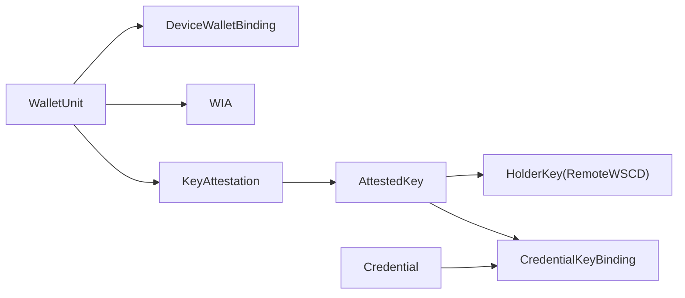

# DI-Swallet: Wallet Provider Backend (WPB)

This repository contains the implementation of the **Wallet Provider Backend (WPB)** for the EU Digital Identity Wallet architecture, as defined in the **DI-Swallet** research project at **Instituto Superior Técnico**.

## 🏗️ Architecture Components
- **WPI (Wallet Provider Interface):** REST API for communication with the User Domain.
- **WSCA (Wallet Secure Cryptographic Application):** Secure service layer managing hardware-backed operations.
- **Remote WSCD (Wallet Secure Cryptographic Device):** Virtualized HSM environment using **SoftHSM2**.
- **Security Interceptor:** Gateway that enforces the **Sole Control** mandate via authorization headers.
- **Key Metadata Store:** Database layer to track key lifecycles (Candidate, Active, Revoked).

## 🛠️ Tech Stack
- **Language:** Kotlin 1.9.24
- **Framework:** Spring Boot 3.5.12
- **Cryptography:** BouncyCastle (Standard Security Provider)
- **Persistence:** Spring Data JPA with PostgreSQL (runtime) + H2 (tests)
- **Standard:** PKCS#11 (SunPKCS11)

## 🚀 Prerequisites
- Ubuntu 24.04 (Noble)
- SoftHSM2: `sudo apt install softhsm2 opensc`
- OpenJDK 17: `sudo apt install openjdk-17-jdk`

## ⚙️ Environment Setup

### 1. Initialize the SoftHSM2 token
Run these commands once to create your virtual hardware vault:
```bash
mkdir -p ~/softhsm/tokens
echo "directories.tokendir = $HOME/softhsm/tokens" > ~/.softhsm2.conf
echo "objectstore.backend = file" >> ~/.softhsm2.conf
softhsm2-util --init-token --free --label "DI-Swallet-WSCD" --pin 1234 --so-pin 123456
```

### 2. Configure the HSM Library Path
The backend needs to know where the SoftHSM2 library is located in your system. 
Open `app/src/main/resources/application.properties` and verify the path:
```properties
# Default path for Ubuntu 24.04
wpb.hsm.library=/usr/lib/x86_64-linux-gnu/softhsm/libsofthsm2.so
```

## 💻 Running the Application

### 1. Start the Persistence Layer (Docker)
The application requires a PostgreSQL database to store key metadata and credentials.
Run the following command in the project root:
```bash
docker compose up -d
```

### 2. Start the Backend (WPB)
The `SOFTHSM2_CONF` variable and library paths are automatically handled by the Gradle build script.
```bash
./gradlew :app:bootRun
```

### 3. Access the API Documentation
Once the server is running, you can interact with the Wallet through the interactive Swagger UI:
👉 **[http://localhost:8080/swagger-ui.html](http://localhost:8080/swagger-ui.html)**

## 🧪 Testing & Validation
Run the automated integration tests to verify the full cryptographic lifecycle:
```bash
./gradlew clean test
```
*The test suite produces clean audit logs showing the interaction between the Security Gateway and the HSM.*

### Test coverage (JaCoCo)
After tests run, Gradle generates a coverage report automatically (`test` is finalized by `jacocoTestReport`):

```bash
./gradlew :app:clean :app:test :app:jacocoTestReport
```

Open the HTML report:
`app/build/reports/jacoco/test/html/index.html`

XML report (for CI tools such as SonarQube):
`app/build/reports/jacoco/test/jacocoTestReport.xml`

Optional minimum line-coverage gate (30% on application code, excluding `WpbApplication`):

```bash
./gradlew :app:jacocoTestCoverageVerification
```

Integration tests that require SoftHSM2 must pass locally for coverage to reflect the full suite; unit tests (OpenID4VP lifecycle, DCQL, matcher, VP builder, etc.) run without the emulator.

## 📂 API Reference

### Mandatory Security
Protected endpoints require `X-Wallet-Authorization`:
- **WebAuthn assertion (expected format):** `fido2-assertion:<Base64URL_JSON>`

Real flow (for development and production-aligned testing):
1. Register a device with `POST /api/v1/wallet/auth/register/{userId}`.
2. Request a challenge with `GET /api/v1/wallet/auth/challenge/{userId}`.
3. Sign the challenge in the client authenticator and send the assertion in `X-Wallet-Authorization`.

### 1. Generate User Key
**Function:** Generates a hardware-protected EC KeyPair inside the HSM and stores metadata in the DB.
- **Endpoint:** `POST /api/v1/wallet/keys/{userId}`
- **Example:**
  ```bash
  curl -i -X POST http://localhost:8080/api/v1/wallet/keys/pedro-ist \
    -H "X-Wallet-Authorization: fido2-assertion:<Base64URL_JSON>"
  ```

### 2. Retrieve Key Metadata
**Function:** Returns the public key and status of a user's wallet.
- **Endpoint:** `GET /api/v1/wallet/keys/{userId}`

### 3. Digital Signature
**Function:** Performs an ECDSA signature inside the HSM boundary. The private key never leaves the hardware.
- **Endpoint:** `POST /api/v1/wallet/sign/{userId}`
- **Example:**
  ```bash
  curl -i -X POST http://localhost:8080/api/v1/wallet/sign/pedro-ist \
    -H "X-Wallet-Authorization: fido2-assertion:<Base64URL_JSON>" \
    -H "Content-Type: application/json" \
    -d '{"data": "Digital Signature Test for IST Thesis"}'
  ```

## 🛡️ Security Note
This implementation ensures that **private keys are non-exportable** and HSM-backed signing is enforced.  
For full production-grade **LoA High/QES** posture, additional hardening remains (for example: trusted attestation configuration and verified onboarding checks).

## OpenID4VP Demo Mode Warning
Some OpenID4VP shortcuts used for local emulator validation are protected behind:

- `wpb.openid4vp.demo-mode=false` (default)

When `wpb.openid4vp.demo-mode=true`, the backend enables demo-only behavior such as:

- accepting a demo pre-registered verifier client (`verifier-demo-client`)
- synthetic credential candidates when the wallet has no matching credentials
- fallback request resolution/dispatch paths for emulator scenarios

Important:

- Never enable `wpb.openid4vp.demo-mode` in production or public environments.
- Keep it enabled only for controlled local testing.

Example (local demo run only):

```bash
./gradlew :app:bootRun --args='--wpb.openid4vp.demo-mode=true'
```

## OpenID4VP / Phase 1 (Protocol Foundations)

This section documents what `Phase 1` of the implementation roadmap delivers
in this code base, and — equally important — what is intentionally **not**
production-ready. The phase is scoped to validating the protocol baseline
and the internal architecture; later phases will replace the placeholders
listed below.

### What Phase 1 delivers

| Capability | Status |
|---|---|
| Orchestrator-centric OpenID4VP lifecycle (`/openid4vp/authorize`, `/consent`, `/session/{id}`, `/session/{id}/events`) | Implemented |
| Formal state machine with runtime-enforced transitions (`RECEIVED → REQUEST_RESOLVED → VERIFIER_VALIDATED → POLICY_EVALUATED → CONSENT_PENDING → CONSENT_GRANTED → VP_BUILT → DISPATCHED`, plus `FAILED / REJECTED / EXPIRED`) | Implemented |
| EUDI OpenID4VP SDK integration behind `OpenId4VpGateway` (strict resolve + dispatch through `eudi-lib-jvm-openid4vp-kt`) | Implemented |
| Demo-only fallback resolver for the local Flask verifier emulator (off by default) | Implemented behind `wpb.openid4vp.demo-mode` |
| Per-query DCQL parsing (`credentials[]` standard form and emulator `query[]` form) | Implemented |
| Credential matching with format filter and per-query requested claim names | Implemented (SD-JWT only) |
| Real SD-JWT presentation generation with disclosure filtering and **Key Binding JWT signed inside the HSM** (`sd_hash`, `aud`, `nonce`) | Implemented |
| Trust validator with client-id prefix validation and configurable allow-list (`wpb.openid4vp.trust.allowed-client-ids`) | Implemented (Phase 1 baseline; full LoTE under Phase 5) |
| Optimistic-locking in-memory session repository with structured `SessionEvent` event store | Implemented |
| Consistent negative/error dispatch to the verifier on every terminal rejection (trust, policy, no-match, consent denial, invalid request with `dispatchDetails`) | Implemented |
| Per-session correlation ID propagated through logs and the event store | Implemented |
| Phase 1 test coverage (state machine, repository, orchestrator happy + negative paths, DCQL parser, matcher, trust validator, SD-JWT VP builder, SDK adapter fallback path) | Implemented |

### Explicit non-production limitations

The items below are **deliberate** within the scope of this thesis prototype.
They are tracked under later phases of `implementation-roadmap.md` and are
either stubbed, partially implemented, or guarded by `demo-mode`.

| Limitation | Why it is acceptable for Phase 1 | Where it will be addressed |
|---|---|---|
| **ISO mdoc presentations are not built**: `CredentialFormat.MDOC` candidates throw `UnsupportedOperationException` from `DefaultVpTokenBuilder`. mdoc is declared in the SDK configuration but no encoder is wired. | Roadmap explicitly defers ISO 18013-5 mdoc support to a later phase. | Phase 7 |
| **Trust validation is a thin baseline**: client-id prefix scheme allow-list plus a static comma-separated trust list. No certificate-chain validation, no List of Trusted Entities (LoTE) lookup, no access-certificate evaluation. | Phase 1 only needs to reject obviously malformed verifiers and document the boundary. | Phase 5 |
| **Response encryption is not negotiated per-request**: `EncryptionParameters` is generated as a fresh random Diffie-Hellman value per dispatch rather than derived from verifier metadata / JWKS. | The wallet still wires the SDK's `ResponseEncryptionConfiguration` (ECDH-ES / A256GCM) and the SDK handles the cryptographic envelope; only the wallet-side contribution is simplified. | Future hardening pass |
| **Demo-mode fallback resolver** parses authorization requests as plain JSON or HS256 JWTs (used by the local emulator). It is off by default and rejects when not enabled. | Required to exercise the protocol end-to-end without operating a full signed-request verifier. | Removed when a real signed verifier is integrated |
| **Verifier emulator** signs request objects with a shared HS256 secret rather than ES256 + JWKS. | It is a local development aid only. | Replaced by a real verifier in interop tests (Phase 17) |
| **Sessions are stored in memory** (`InMemoryPresentationSessionRepository`) and the SDK adapter keeps `ResolvedRequestObject` in a per-instance `ConcurrentHashMap`. | A single instance is enough for Phase 1 protocol validation. | Phase 10 (durable transaction log) |
| **Policy engine is intentionally permissive**: it only validates trust + at-least-one candidate. RP-intended-use / attribute-minimisation policies are out of scope here. | Aligned with the roadmap's Phase 16 scoping. | Phase 16 |
| **OpenID4VP endpoints (`/openid4vp/**`) are not behind the FIDO2 interceptor**. Only `/api/v1/wallet/**` is gated by `X-Wallet-Authorization`. | The presentation flow is intended to be initiated by a holder-authenticated UI in a later phase. | Phase 16 / production hardening |
| **WIA / KA / device binding** is not exercised inside the OpenID4VP flow. The credential's KB-JWT is signed by the holder's HSM key but no WIA is attached. | Roadmap defers WIA/KA to dedicated phases. | Phase 3 (WIA) and Phase 4 (KA) |
| **Array-of-object paths** (wildcard/index into arrays of objects) depend on issuer structuring; only scalar arrays and key paths are matched. | PID rulebook often uses flat dot-notation or whole-array claims. | Real issuer credentials + interop (Phase 17) |
| **Deeply nested SD-JWT** (objects within objects, each with `_sd`) is only supported for one nesting level in mock issuance. | Covers typical PID `address` object + Phase 1 DCQL paths. | Full recursive issuance with external issuers (Phase 2/17) |

### Configuration knobs

```
wpb.openid4vp.demo-mode=false               # enable local emulator fallback (off by default)
wpb.openid4vp.trust.allowed-client-ids=     # CSV allow-list of verifier client_id values (empty = open)
wpb.openid4vp.session.ttl-seconds=600       # presentation session expiry
```

### End-to-end smoke flow with the emulator

```bash
# 1. start the verifier emulator (Flask, port 8081)
cd verifier-emulator && python3 -m venv .venv && .venv/bin/pip install -r requirements.txt && .venv/bin/python app.py

# 2. start the wallet with demo-mode enabled
./gradlew :app:bootRun --args='--wpb.openid4vp.demo-mode=true'

# 3. start a presentation session against the emulator's request_uri
curl -X POST http://localhost:8080/openid4vp/authorize \
  -H 'Content-Type: application/json' \
  -d '{"requestUri":"http://localhost:8081/request/direct_post.json","holderId":"pedro-ist"}'

# 4. submit consent (sessionId from step 3)
curl -X POST http://localhost:8080/openid4vp/consent \
  -H 'Content-Type: application/json' \
  -d '{"sessionId":"<uuid>","granted":true}'

# 5. inspect the lifecycle trail
curl http://localhost:8080/openid4vp/session/<uuid>/events | jq .
```

## OpenID4VCI / Phase 2 (Issuance Core)

Phase 2 extends the wallet with an OID4VCI orchestrator that follows the
exact same architectural rules as Phase 1 (adapter-based, orchestration-centered,
SDK-decoupled, lifecycle/state-machine driven, session persistence, audit/event
model). The wallet acts strictly as a **wallet-side** OID4VCI client and never
implements issuer endpoints.

### What Phase 2 delivers

| Capability | Status |
|---|---|
| Orchestrator-centric OID4VCI lifecycle (`/openid4vci/offer/resolve`, `/authorize/prepare`, `/authorize/code`, `/authorize/pre-authorized`, `/credential/request`, `/deferred/query`, `/notify`, `/session/{id}`, `/session/{id}/events`) | Implemented |
| Formal state machine with runtime-enforced transitions (`OFFER_RECEIVED → OFFER_RESOLVED → AUTHORIZATION_PREPARED → AUTHORIZED → CREDENTIAL_REQUESTED → CREDENTIAL_ISSUED → NOTIFIED`, deferred branch via `DEFERRED_PENDING → DEFERRED_ISSUED`, plus `FAILED / REJECTED / EXPIRED`) | Implemented |
| Adapter port `OpenId4VciGateway` isolates the EUDI library (only `openid4vci.adapter` may import `eu.europa.ec.eudi.openid4vci.*`) | Implemented |
| Credential offer resolution (by-value and by-reference) producing `ResolvedOffer` + `ResolvedIssuerMetadata` | Implemented (simulated default; SDK adapter when `demo-mode=false`) |
| Authorization-code grant with PKCE + automatic PAR usage when supported + DPoP probe | Implemented (simulated default; SDK adapter when `demo-mode=false`) |
| Pre-authorized-code grant with optional `tx_code` | Implemented (simulated default; SDK adapter when `demo-mode=false`) |
| Credential request via `credential_configuration_id` or `credential_identifier` (HAIP SD-JWT VC) | Implemented (simulated default; SDK adapter when `demo-mode=false`) |
| Deferred issuance: `transaction_id` persistence, polling, resumed issuance with stable PoP key | Implemented (simulated default; SDK adapter when `demo-mode=false`) |
| Wallet → Issuer notifications: `CREDENTIAL_ACCEPTED`, `CREDENTIAL_DELETED`, `CREDENTIAL_FAILURE` | Implemented (simulated default; SDK adapter when `demo-mode=false`) |
| SDK-backed adapter (`SdkOpenId4VciGateway`) exercised end-to-end via WireMock + Spring orchestrator test | Implemented |
| HSM-backed proof material (`HsmBackedProofMaterialProvider` + `HsmProofJwtSigner`) as default Spring wiring | Implemented |
| Issuer `signed_metadata` JWT validation (`preferSigned` / `requireSigned` / `ignoreSigned`) | Implemented |
| Issued credential persistence into the existing `WalletCredentialRepository` (SD-JWT split into encoded JWT + AES-GCM-encrypted disclosures) | Implemented |
| Issuer trust validator with configurable allow-list (`wpb.openid4vci.trust.allowed-issuer-ids`) | Implemented |
| Issuance policy with mdoc opt-out (`wpb.openid4vci.policy.allow-mdoc=false`) | Implemented |
| Optimistic-locking in-memory session repository (`InMemoryIssuanceSessionRepository`) | Implemented |
| Structured event store (`IssuanceEvent` + `InMemoryIssuanceEventStore`) with correlation IDs | Implemented |
| JaCoCo coverage gate for Phase 2 module: ≥ 50% (current actual: ~90%) | Implemented |
| Phase 2 test suite (state machine, repository, policy, trust, simulated adapter happy + deferred + negative, orchestrator real-beans flow, controller, storage, proof, event store) | Implemented |

### Explicit non-production limitations

| Limitation | Why it is acceptable for Phase 2 | Where it will be addressed |
|---|---|---|
| **Default runtime and CI test profile keep `demo-mode=true`**, so the simulated adapter remains the primary local smoke path. Real issuer interop (`SdkOpenId4VciGatewayRealIssuerIT`) is opt-in via env vars. | Deterministic simulator for day-to-day development; SDK path validated against WireMock in `SdkOpenId4VciOrchestratorE2ETest`. | Scheduled/manual smoke against a live PID Provider when WIA crypto is production-ready (Phase 3). |
| **Issuer trust is still an allow-list** plus `signed_metadata` JWT verification — no federation/LoTE trust-list lookup and no full metadata PKIX policy. | Phase 2 rejects unknown issuers and enforces `wpb.openid4vci.sdk.metadata-policy`. | Phase 5 (trust framework). |
| **`EphemeralProofMaterialProvider` is disabled by default** (`wpb.openid4vci.proof.ephemeral-fallback=false`). Unit tests may still construct it manually. | Production wiring uses `HsmBackedProofMaterialProvider` (`@Primary`) and `HsmProofJwtSigner`. | — |
| **mdoc issuance is deferred**: the simulator returns `unsupported_format` for `MSO_MDOC` and the policy rejects mdoc credential configurations unless `wpb.openid4vci.policy.allow-mdoc=true`. | The roadmap defers mdoc to Phase 7. | Phase 7 (ISO 18013-5). |
| **Sessions are stored in memory** (`InMemoryIssuanceSessionRepository`) and adapter SDK state is per-instance. Optimistic locking is in place but no JPA persistence. | Single-instance prototype is enough for Phase 2 protocol validation. | Phase 10 (durable transaction log). |
| **Deferred polling uses a counter** in the simulator (`wpb.openid4vci.simulator.deferred-polls-before-issue`) rather than real issuer-driven retry hints. | The simulator must produce deterministic deferred behaviour for tests. | Replaced by real issuer interaction in Phase 3. |
| **`/openid4vci/**` endpoints are not gated by the FIDO2 interceptor** (same as Phase 1's `/openid4vp/**`). | Issuance flows are intended to be initiated by a holder-authenticated UI in a later phase. | Phase 16 / production hardening. |
| **The simulated SD-JWT VC payload is syntactically shaped but cryptographically meaningless** (no real issuer signature, no real `cnf` binding). | Phase 2 validates the orchestration contract, not credential cryptography (Phase 1 already exercises real signature production). | Real issuer signatures arrive with the SDK adapter wiring. |
| **By-reference offer resolution does not actually fetch the URL** in the simulator. | A real HTTP fetch belongs to the SDK-backed adapter. | SDK adapter hardening. |

### Configuration knobs

```
wpb.openid4vci.demo-mode=true                                # simulated adapter (default)
wpb.openid4vci.session-ttl-seconds=1800                      # issuance session expiry
wpb.openid4vci.trust.allowed-issuer-ids=                     # CSV allow-list (empty + demo-mode permissive)
wpb.openid4vci.trust.clock-skew-seconds=60                  # signed_metadata JWT exp/nbf/iat tolerance
wpb.openid4vci.proof.ephemeral-fallback=false                 # true only for isolated unit tests
wpb.openid4vci.policy.allow-mdoc=false                       # opt-in mdoc
wpb.openid4vci.simulator.always-defer=false                  # force deferred outcome
wpb.openid4vci.simulator.deferred-polls-before-issue=1       # polls before simulated issuance
wpb.openid4vci.sdk.credential-issuer-id=                     # hint for real SDK adapter
wpb.openid4vci.sdk.dpop-mode=supported                       # supported | required | disabled
wpb.openid4vci.sdk.metadata-policy=preferSigned              # preferSigned | requireSigned | ignoreSigned
wpb.openid4vci.sdk.pkce-required=true                        # PKCE always enforced
wpb.openid4vci.sdk.use-par-when-supported=true               # send PAR when issuer advertises it
```

### End-to-end smoke flow with the simulator

```bash
# 1. start the wallet (demo-mode is the default)
./gradlew :app:bootRun

# 2. resolve a credential offer (by-value)
OFFER='openid-credential-offer://credential_offer={"credential_issuer":"https://issuer.example","credential_configuration_ids":["pid_jwt"]}'
curl -X POST http://localhost:8080/openid4vci/offer/resolve \
  -H 'Content-Type: application/json' \
  -d "{\"offerUri\":\"$OFFER\",\"holderId\":\"pedro-ist\"}"

# 3. prepare the authorization-code grant
curl -X POST http://localhost:8080/openid4vci/authorize/prepare \
  -H 'Content-Type: application/json' \
  -d '{"sessionId":"<uuid>"}'

# 4. complete the authorization-code grant
curl -X POST http://localhost:8080/openid4vci/authorize/code \
  -H 'Content-Type: application/json' \
  -d '{"sessionId":"<uuid>","authorizationCode":"code-abc","state":"<state-from-prepare>"}'

# 5. request the credential
curl -X POST http://localhost:8080/openid4vci/credential/request \
  -H 'Content-Type: application/json' \
  -d '{"sessionId":"<uuid>","credentialConfigurationId":"pid_jwt"}'

# 6. notify the issuer
curl -X POST http://localhost:8080/openid4vci/notify \
  -H 'Content-Type: application/json' \
  -d '{"sessionId":"<uuid>","event":"CREDENTIAL_ACCEPTED"}'

# 7. inspect the lifecycle trail
curl http://localhost:8080/openid4vci/session/<uuid>/events | jq .
```

## OpenID4VCI / WIA (Wallet Instance Attestation)

WIA is integrated as a **sub-context inside the existing issuance flow**, not as a
separate top-level lifecycle. The issuance orchestrator selects or issues a WIA,
attaches it to PAR/token transport, validates technical freshness, and verifies
that the access token `cnf.jkt` matches the WIA `cnf` key before credential
issuance proceeds.

There is **no** public `POST /wia/issue` endpoint in this increment.

### What WIA delivers

| Capability | Status |
|---|---|
| WIA sub-context on `IssuanceContext` (`WiaState`, `WiaContext`, `WalletInstanceAttestation`) | Implemented |
| `WalletAttestationProvider` abstraction with `DefaultWalletAttestationProvider` (generation) | Implemented |
| WIA transport envelope on `OpenId4VciGateway` (`WalletAttestationTransport` on PAR/token paths) | Implemented (simulated adapter) |
| WIA validation service (technical expiry + `cnf.jkt` binding against access token) | Implemented |
| Simplified WIA status management via existing bitstring status list (`WiaStatusManagementService`) | Implemented |
| Persistent `cnf` key per wallet instance (RFC 7638 JWK thumbprint of `WalletKey` EC public key) | Implemented |
| HSM-backed WIA/PoP JWT signing via `JwsSigningService` with parsed `x5c` certificate chain | Implemented |
| Durable WIA status index mapping (`JpaWiaStatusManagementService` + `wia_status_indexes`) | Implemented |
| Structured issuance events: `wia.attached`, `wia.binding.verified` | Implemented |
| Retry semantics for nonce mismatch / expired WIA (configurable limits, recoverable errors) | Implemented |
| Default reuse policy per issuer: `false` (`wpb.openid4vci.wia.reuse-per-issuer`) | Implemented |
| WIA-specific unit tests (validation, status management, orchestrator + adapter integration) | Implemented |

### Explicit non-production limitations

| Limitation | Why it is acceptable for the thesis MVP | Where it will be addressed |
|---|---|---|
| **No issuer-side WIA trust-anchor validation** (wallet signs with HSM + publishes `x5c`, but LoTE/PKIX federation is not enforced). | Issuer trust of Wallet Provider certificates belongs to external PID Providers and Phase 5 trust framework. | LoTE trust anchors and access-certificate validation. |
| **No issuer-side WIA signature/trust validation** (wallet only generates and self-checks binding). | Issuer validation belongs to external PID/Attestation Providers, not the WPB. | Interop tests with real issuers. |
| **DPoP proof headers are modeled via `cnf.jkt` binding**, not full RFC 9449 DPoP JWT construction against live AS metadata. | Phase goal is WIA transport + AT binding correctness, not full OAuth stack hardening. | SDK adapter + production OAuth profile. |
### Configuration knobs

```
wpb.openid4vci.wia.enabled=true
wpb.openid4vci.wia.token-ttl-seconds=21600                 # WIA JWT exp (< 24h)
wpb.openid4vci.wia.min-status-maintenance-days=31          # client_status.exp horizon
wpb.openid4vci.wia.reuse-per-issuer=false                 # privacy-first default
wpb.openid4vci.wia.wallet-name=DI-Swallet-WPB
wpb.openid4vci.wia.wallet-version=0.1.0
wpb.openid4vci.wia.wallet-link=
wpb.openid4vci.wia.wallet-solution-certification-information=thesis-mvp-not-certified
wpb.openid4vci.wia.signing-x5c=
wpb.openid4vci.wia.max-nonce-mismatch-retries=1
wpb.openid4vci.wia.max-expired-retries=1
```

### WIA-related events in issuance sessions

After `authorize/prepare` or `authorize/code`, inspect:

```bash
curl http://localhost:8080/openid4vci/session/<uuid>/events | jq '.[] | select(.type | startswith("wia."))'
```

Expected event types in the happy path:

- `wia.attached`
- `wia.binding.verified`

## OpenID4VCI / KA (Key Attestation)

KA is now enforced for device-bound issuance configurations inside the existing
issuance lifecycle. There is no dedicated public KA endpoint: the wallet
generates and validates KA just before `requestCredential`, then attaches it as
`key_attestation` proof material in the credential request transport.

### Explicit limitations (still non-production)

| Limitation | Why acceptable now | Planned hardening |
|---|---|---|
| Trust validation policy is allow-list/config based (`require-x5c`, `allowed-x5c-fingerprints`) and not LoTE-grade chain validation. | Sufficient for thesis phase isolation and deterministic tests. | LoTE and trust-anchor validation hardening in trust phases. |
| Strict SDK resolution requires SDK-compatible issuer endpoints (typically HTTPS); local `http://` offer/metadata testing requires explicitly disabling strict mode. | Keeps production path strict while preserving local mock-based integration tests. | Keep strict mode enabled by default and use test-only overrides when needed. |
| Real-issuer interoperability validation is provided as an opt-in smoke test and depends on external issuer availability/configuration. | Avoids coupling CI stability to external systems while still enabling real environment validation. | Expand into repeatable interop suite when a stable issuer sandbox is available. |

### Important notes

- Keep `wpb.openid4vci.sdk.strict-resolution=true` in production-like environments; this disables local fallback parsing and forces SDK resolver success.
- For local WireMock/`http://localhost` integration tests, set strict mode to `false` explicitly (test profile only).
- Real issuer smoke validation is available through `SdkOpenId4VciGatewayRealIssuerIT` and runs only when:
  - `WPB_REAL_ISSUER_ENABLED=true`
  - `WPB_REAL_ISSUER_OFFER_URI=<real offer URI>`
- Example:

```bash
WPB_REAL_ISSUER_ENABLED=true \
WPB_REAL_ISSUER_OFFER_URI='openid-credential-offer://...' \
./gradlew :app:test --tests "di.swallet.wpb.openid4vci.adapter.SdkOpenId4VciGatewayRealIssuerIT"
```

## Phase 8 - Device binding and key management runtime

This section captures the implemented runtime model for device binding and key
management aligned with the DI_Swallet server-side architecture.

### Summary of decisions

- The architecture baseline remains **DI_Swallet server-side** with holder keys in
  **remote WSCD/HSM**.
- Device bootstrap keys are **not** holder keys:
  - device-local keys: device authentication / DPoP / wallet bootstrap
  - holder keys: SD-JWT and mdoc holder binding, presentation signatures
- Two bindings are mandatory and independent:
  - `device -> wallet`
  - `credential -> holder key`
- Key Attestation (KA) is modeled as a **first-class persisted aggregate**, not
  only projected fields on keys.
- Anti-correlation default policy is `new KA + new key` per issuance/re-issuance.
  ISSU_12b key-reuse remains a policy exception (not default).

### Conceptual cardinality




```text
WalletUnit
  ├─ DeviceWalletBinding
  ├─ WIA
  └─ KeyAttestation
       └─ AttestedKey
            ├─ HolderKey (RemoteWSCD)
            └─ CredentialKeyBinding
                 └─ Credential
```

### Non-production simplifications

- Device attestation cryptographic verification pipeline is still simulated
  (no full platform attestation trust-chain validation yet).
- DB schema evolution currently relies on `spring.jpa.hibernate.ddl-auto=update`;
  explicit migration scripts are still pending.
- Wallet init / bind payloads currently accept JWK material directly and use a
  deterministic thumbprint hash as binding key in this MVP increment.
